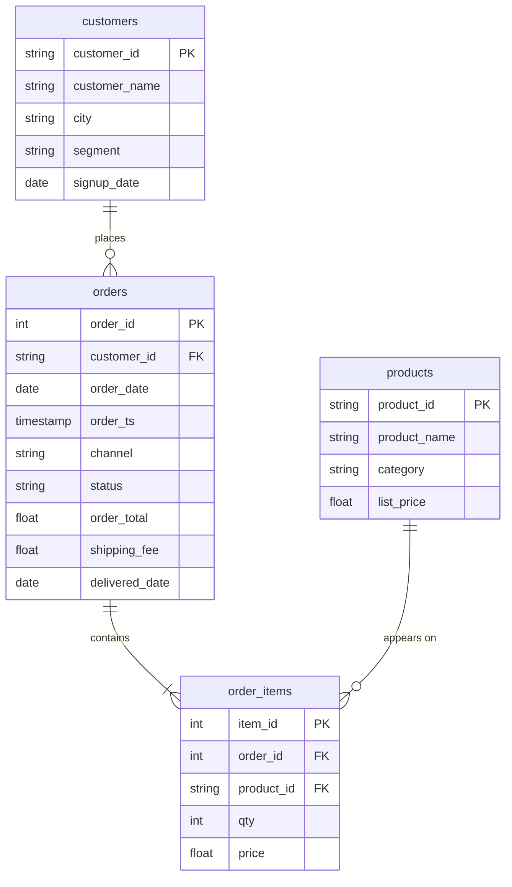

# Nakheel Retail

Nakheel Retail is the business you will work with for most of the programme: a Jordanian clothing and footwear retailer with stores and an online shop. You meet it on D04 and keep using it through SQL, Power Query and Power BI.

It is synthetic. Every customer, product and order was generated for this course by a script, so no real person's data is in it, and every expected answer in the labs stays fixed.

| Fact | Value |
|---|---|
| Source | Generated for ASAC on 24 September 2026 by a seeded script (seed 20260927). No third-party data |
| Terms | Course-owned. Reuse freely inside ASAC materials |
| Period | Orders from 1 September 2024 to 31 August 2026: 24 full months |
| Snapshot | Taken at the end of 31 August 2026. Orders placed in the last days of August may not be delivered yet |
| Currency | Jordanian dinar (JOD) |
| Encoding | UTF-8, comma-separated, one header row |

## Files

| File | Rows | Columns |
|---|---:|---|
| `customers.csv` | 500 | `customer_id`, `customer_name`, `city`, `segment`, `signup_date` |
| `products.csv` | 60 | `product_id`, `product_name`, `category`, `list_price` |
| `orders.csv` | 3,000 | `order_id`, `customer_id`, `order_date`, `order_ts`, `channel`, `status`, `order_total`, `shipping_fee`, `delivered_date` |
| `order_items.csv` | 7,516 | `item_id`, `order_id`, `product_id`, `qty`, `price` |

Upload each file into a BigQuery dataset named `nakheel`, using the table names above without `.csv`. Follow the steps in the [activity README](../README.md).

## Columns

| Table | Column | Meaning |
|---|---|---|
| `customers` | `customer_id` | Customer account number, for example `C-1001` |
| | `customer_name` | Name on the account |
| | `city` | City on the account. Empty when the customer did not give one |
| | `segment` | `Retail` (individual shoppers) or `Wholesale` (shops that buy in bulk), as typed by staff at sign-up |
| | `signup_date` | Date the account was opened |
| `products` | `product_id` | Product code, for example `P-001` |
| | `product_name` | Name on the shelf label |
| | `category` | One of six: Shoes, Outerwear, Tops, Bottoms, Accessories, Sportswear |
| | `list_price` | Current shelf price for one unit, in dinars |
| `orders` | `order_id` | Order number from the till or the website |
| | `customer_id` | The customer who placed the order |
| | `order_date` | Date the order was placed |
| | `order_ts` | Date and time the order was placed (a `TIMESTAMP`) |
| | `channel` | `store` or `online` |
| | `status` | `completed`, `cancelled` or `pending` (placed, not yet delivered) |
| | `order_total` | Value of the goods on the order, in dinars, before shipping |
| | `shipping_fee` | Delivery charge on the order, in dinars. Zero for store orders and for online orders of 50 dinars or more |
| | `delivered_date` | Date the order reached the customer. Empty if it has not been delivered |
| `order_items` | `item_id` | Line number, unique across all orders |
| | `order_id` | The order this line belongs to |
| | `product_id` | The product on this line |
| | `qty` | Units of the product on this line |
| | `price` | Price of one unit when the order was placed, in dinars. Multiply by `qty` for the line value |

## How the tables connect

PK is the primary key, FK a foreign key. BigQuery does not enforce either, so a key is a promise the data makes and you check. D05 shows how.

Like any real extract, these tables have problems in them. They are there on purpose and finding them is part of the work, so do not clean the files before you upload them.

## Reproducing the files

The files are generated by a private script (`instructor/w02/make_nakheel.py`) and checked by a second one (`instructor/w02/nakheel_checks.py`). Running the generator again produces byte-identical files.
