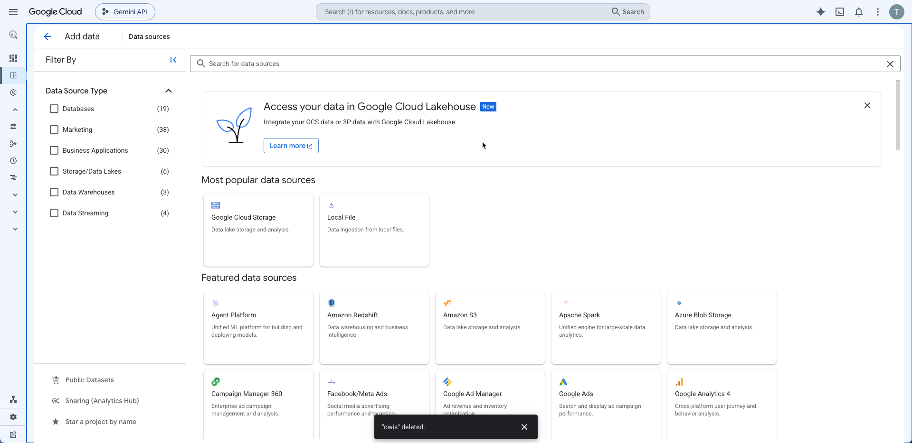
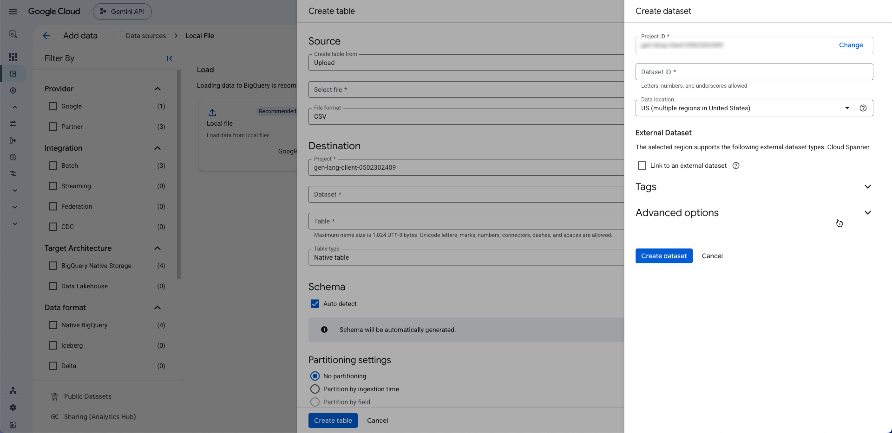
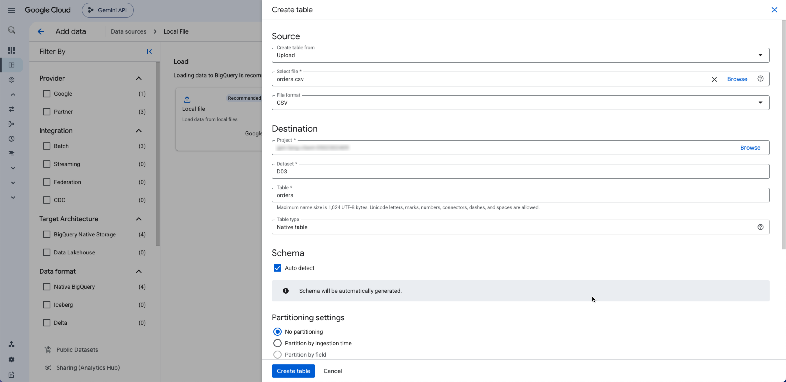
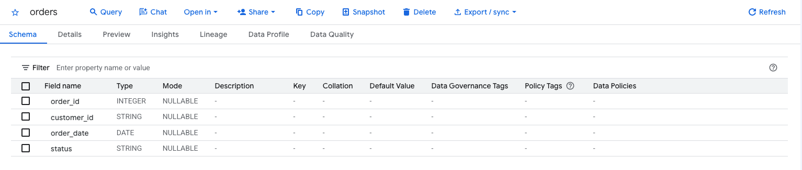
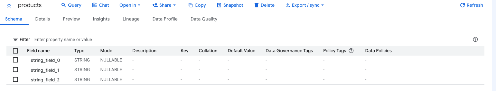
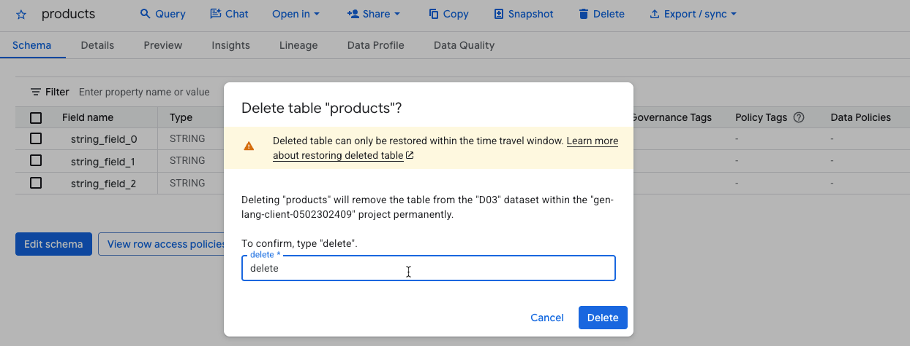
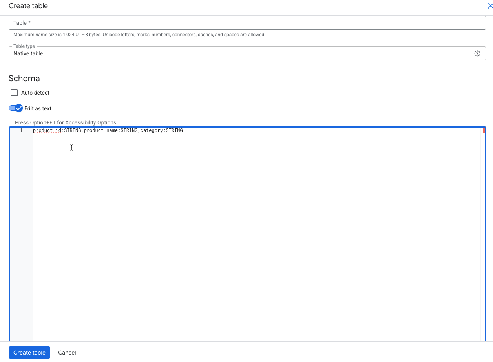
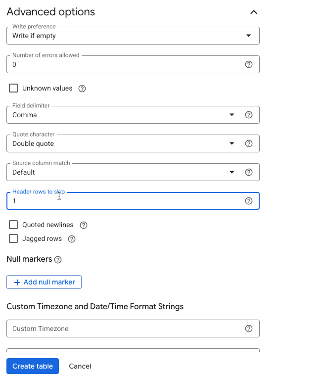
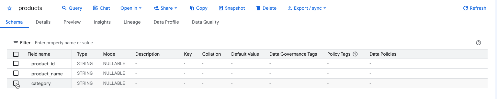

# Upload a CSV to BigQuery

This guide takes a CSV file from the course GitHub page into a table in your own BigQuery Sandbox project. You do it with the class on D03, then again on your own for every new dataset this week. The first upload takes about ten minutes; after that, about two minutes a file.

**You need:** a Google account with a working BigQuery Sandbox project (Week 1 setup), a laptop with Chrome or Edge, and the CSV file.

**You will have at the end:** a dataset with one table per CSV file, the right number of rows in each, and column names you can read.



## The names you will use this week

| BigQuery dataset | Tables (one CSV each) | Where the files are | Day |
|---|---|---|---|
| `D03` | `orders`, `order_items`, `customers`, `products` | [`modules/01-data-foundations/datasets/w01_retail/`](../../01-data-foundations/datasets/w01_retail/) | D03 |
| `owid` | `life_expectancy_data` | [`shared/datasets/owid_life_expectancy/`](../../../shared/datasets/owid_life_expectancy/) | D03 lab |
| `nakheel` | `customers`, `products`, `orders`, `order_items` | [`shared/datasets/nakheel/`](../../../shared/datasets/nakheel/) | D04 |
| `pagila` | `film`, `category`, `film_category` | [`shared/datasets/pagila/`](../../../shared/datasets/pagila/) | D05 lab |

Use these names exactly: `D03` with a capital D, the others in lower case. The lab files are written for them, and BigQuery names are case-sensitive: it treats `Orders` and `orders` as different tables, and `d03` and `D03` as different datasets. The life-expectancy table is `life_expectancy_data`, not `life_expectancy`, because a table must not share its name with one of its columns (see the D03 lab's BigQuery note).

A BigQuery name has three parts: **project**, **dataset**, **table**. Think of them as the database server you rent, a folder in it, and a table in the folder. Your project already exists. You create a dataset, then upload one CSV per table into it.

## 1. Download the CSV files

1. Open the course GitHub page and go to the folder for the dataset (table above).
2. Click a file name, for example `orders.csv`. GitHub shows the rows as a table.
3. Click the **Download raw file** button (a downward arrow, top right of the file view). The file saves to your Downloads folder as `orders.csv`.
4. Repeat for each file in the folder.

Do not open the files in Excel and save them again. Excel can change date formats and strip leading zeros from codes, and the upload then gives different results from everyone else's. If you want to look at a file, open it in Notepad, or look at it on GitHub.

If the saved file ends in `.txt` or `.html`, you saved the web page rather than the file. Delete it and use the **Download raw file** button.

## 2. Open BigQuery and check your project

1. Go to [console.cloud.google.com/bigquery](https://console.cloud.google.com/bigquery) and sign in with the Google account you used for Week 1.
2. At the top of the page, next to the Google Cloud logo, check the project name. It should be your sandbox project. If it is not, click it and choose yours.
3. Find the **Explorer** pane on the left. Your project is listed there. Expand it with the arrow beside its name.

A banner may say you are using the BigQuery Sandbox and offer an upgrade. You do not need to upgrade, and the course never asks you to add a card. Close the banner.

## 3. Create the dataset

1. In the Explorer pane, point at your project name and click the **⋮** (View actions) button beside it.
2. Click **Create dataset**.
3. In **Dataset ID**, type the dataset name from the table above, for example `D03`.
4. For **Location type**, choose **Multi-region**, then **US**. The public datasets you will read later this week are also in the US, and keeping everything in one place avoids a "not found in location" error.
5. Leave everything else as it is and click **Create dataset**.

The dataset appears under your project in Explorer. In the sandbox, tables in it expire 60 days after you create them. Tables made on 27 September last until late November, after the programme ends, but download anything you want to keep.



## 4. Upload one file as a table

1. In Explorer, point at the new dataset, click its **⋮** button, and click **Create table**.
2. Under **Source**, set **Create table from** to **Upload**.
3. Click **Browse** and choose the CSV file, for example `orders.csv`. **File format** changes to **CSV** by itself; if it does not, choose CSV.
4. Under **Destination**, check that **Project** is yours and **Dataset** is the one you just made. In **Table**, type the table name without `.csv`, for example `orders`.
5. Under **Schema**, tick **Auto detect**. BigQuery reads the first rows of the file and guesses a column name and a type for each column.
6. Open **Advanced options** at the bottom of the panel. Set **Header rows to skip** to `1`. Leave the other options as they are.
7. Click **Create table**.



A small job runs for a few seconds. When it finishes, the table appears under the dataset in Explorer.

Why step 6 matters: the first line of each course file is a header row of column names. Setting **Header rows to skip** to 1 tells BigQuery that line is not data. With Auto detect on, BigQuery uses that line for the column names.

## 5. Check the table before you query it

Click the table name in Explorer. Three tabs matter.

1. **Schema** lists each column with the type BigQuery guessed. Read it. Does `order_date` say `DATE`? Does `order_id` say `INTEGER`? Is every column name the name from the header row?
2. **Details** shows **Number of rows**. Compare it with the row count in the dataset's README. Five rows in `D03.orders`, for example.
3. **Preview** shows the first rows. Preview is free: it does not run a query and does not use your query allowance.



Empty cells in the CSV load as `NULL`, which BigQuery shows in Preview as the word `null`. That is correct. It is how a database records "no value", and D03 shows how to find these rows.

## 6. When every column is text

Some files have no numbers or dates at all. `D03.products` is one: `product_id`, `product_name` and `category` are all text. Auto detect cannot tell a header row of text from data rows of text, so it cannot find the column names. Google's documentation says so: "Loading CSV data using schema autodetection does not automatically detect headers if all of the columns are string types. In this case, add a numerical column to the input or declare the schema explicitly." You get a table whose columns are called `string_field_0`, `string_field_1` and `string_field_2`.



The fix is to tell BigQuery the column names yourself.

1. Delete the table: click it in Explorer, then **⋮** > **Delete**, and type `delete` to confirm. You lose nothing; the CSV is still in your Downloads folder.

    

2. Start **Create table** again, with the same source and destination.

3. Under **Schema**, leave **Auto detect** unticked and switch on **Edit as text**.

4. In the text box, type the columns and their types in order, separated by commas:

    ```text
    product_id:STRING,product_name:STRING,category:STRING
    ```

5. In **Advanced options**, set **Header rows to skip** to `1`, so the header row is not loaded as a product.

6. Click **Create table** and check the Schema tab again.







The same method fixes any column whose type Auto detect guessed wrong: type the whole schema as text with the type you want. The types you will meet this week are `STRING`, `INTEGER`, `FLOAT`, `NUMERIC`, `DATE` and `TIMESTAMP`.

## 7. Repeat for the other files

Each CSV becomes one table. For the next files, repeat section 4 (and section 6 if a file is all text) and check each one as in section 5. You create the dataset only once.

## Troubleshooting

| What you see | Why | What to do |
|---|---|---|
| Columns named `string_field_0`, `string_field_1` … | Every column in the file is text, so Auto detect could not find the header row | Delete the table and follow section 6 |
| The first row of Preview contains the column names (`product_id`, `product_name` …) as data | **Header rows to skip** was left at 0 with a schema typed as text | Delete the table and upload again with Header rows to skip = 1 |
| Error: `Could not parse 'order_id' as INT64` (or another column name) | The header row was read as data under a typed schema | As above: Header rows to skip = 1 |
| Error: `Already Exists: Table` | A table with that name is already in the dataset, often from a first attempt | Delete the old table first, or give the new one the correct name if the old one was misnamed |
| Error: `Not found: Dataset … was not found in location …` | The dataset was created outside the US, or the query runs in a different location from the table | Create the dataset again in Multi-region US and upload the files into it |
| Error: `Not found: Table` in a query | The table name in the query does not match the one in Explorer, often a capital letter or a `_csv` ending | Compare the names character by character in Explorer. Rename by uploading again with the right name |
| Row count lower or higher than the README says | The wrong file, a file re-saved by Excel, or an upload into the wrong table | Download the file again from GitHub with **Download raw file**, delete the table, upload again |
| A date column shows as `STRING` | The file was opened and saved in Excel, which rewrote the dates | Download the file again and upload it without opening it in Excel |
| An amount shows a long tail of decimals, such as `114.04673…` or `…0000001` | Auto detect stores amounts as `FLOAT`. Averages rarely come out even, and `FLOAT` arithmetic can leave tiny rounding errors | Round money results in your query: `ROUND(AVG(order_total), 2)` |
| A banner says the table expires in 60 days | This is the sandbox's normal limit | Nothing to fix. Export results you want to keep before then |
| A prompt asks you to enable billing or start a free trial | The sandbox does not need billing for anything in this course | Close it. If an action you need is blocked, tell your TA in your group channel |

If you are still stuck after one retry, post in your group channel with a screenshot of the error and the Schema tab, and say which file you were uploading.

## Sources

Checked on 24 September 2026. Product wording and menus change; the platform notes record what was verified and when.

- Google Cloud, [Batch loading data](https://cloud.google.com/bigquery/docs/batch-loading-data) (loading a local file from the console).
- Google Cloud, [Loading CSV data from Cloud Storage](https://cloud.google.com/bigquery/docs/loading-data-cloud-storage-csv) (header rows to skip; headers are not detected when every column is text).
- Google Cloud, [BigQuery sandbox](https://cloud.google.com/bigquery/docs/sandbox) (60-day table expiry, 10 GiB storage, no DML).
