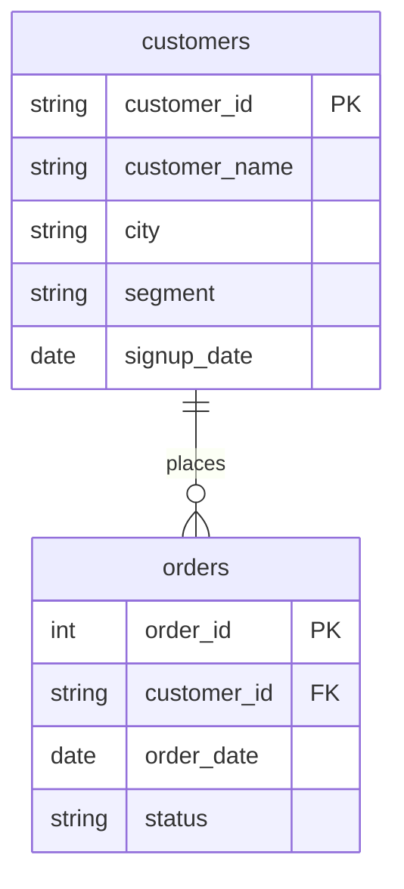

# INNER JOIN and LEFT JOIN

In this activity, you will join the D01 orders and customers two ways, and see which rows each kind of join keeps.

**Time:** 22 minutes · **Data:** `D03.orders`, `D03.customers` · **Starter:** `Unsolved/inner_and_left.sql`

## How the tables connect

Join key: `orders.customer_id = customers.customer_id`.

PK is the primary key: it names one row. FK is a foreign key: it points to a row in another table. The line between two tables shows the join: the end with two short bars is the "one" side, and the end that splits into a fork is the "many" side.

## Instructions

Before you start, run the Five Checks out loud for `orders` and `customers`, and predict the row count of each query.

1. Show each order with its customer's name and city.

    Translate: `orders` `INNER JOIN` `customers` `ON o.customer_id = c.customer_id`.

2. Show every customer, with their orders if they have any.

    Translate: `customers` `LEFT JOIN` `orders`, customers on the left.

3. Copy query 2 and change `LEFT JOIN` to `INNER JOIN`. Which customers disappear, and why?

## Check yourself

| Query | Rows returned | One value to check |
|---|---:|---|
| 1 | 5 | order 1004 is Omar Nasser (C-401) |
| 2 | 7 | C-377 and C-455 have `NULL` in `order_id` |
| 3 | 5 | C-377 and C-455 are gone |

## Hint

`FROM D03.orders AS o` gives the table a short name. Then `o.customer_id` means "the `customer_id` column of `orders`", which matters because both tables have a column with that name.

## Bonus

Query 2 has 7 rows for 5 customers. Which customers appear twice, and why is that correct?

## References

The D01 tables, course-owned synthetic data, 19 September 2026.
