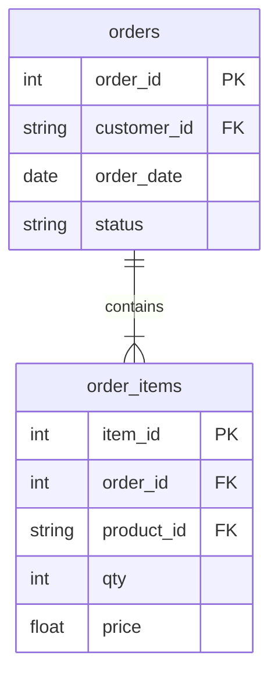

# How many completed orders?

In this activity, you will answer one question on one table, then again after a join, and find out why the second answer is wrong even though the join is right. Then you will answer a question that does need the join.

**Time:** 10 minutes · **Data:** `D03.orders`, `D03.order_items` · **Starter:** `Unsolved/count_completed_orders.sql`

## How the tables connect

Join key: `order_items.order_id = orders.order_id`.

PK is the primary key: it names one row. FK is a foreign key: it points to a row in another table. The line between two tables shows the join: the end with two short bars is the "one" side, and the end that splits into a fork is the "many" side.

## Instructions

1. "How many completed orders do we have?" Count them on `D03.orders`.

2. Join `D03.order_items` to `D03.orders` on `order_id`, keep completed orders, and count the rows again.

3. Say what one row is after the join. Change the count so it answers the question.

4. "How many completed orders included at least one item priced 20 or more?" Here "priced" means the unit `price`, not `qty * price`. This question needs both tables: `status` is in `orders` and `price` is in `order_items`. Write it with `COUNT(*)` first (4a), then with `COUNT(DISTINCT o.order_id)` (4b). Which one answers the question?

## Check yourself

| Query | Rows returned | One value to check |
|---|---:|---|
| 1 | 1 | 4 |
| 2 | 1 | 10 |
| 3 | 1 | 4 |
| 4a | 1 | 3 with `COUNT(*)` |
| 4b | 1 | 2 with `COUNT(DISTINCT o.order_id)`: 2 is the answer |

## Why 10 is wrong, and when you need the join

Nothing is wrong with the join. After it, one row is one product on one order, so `COUNT(*)` counts order lines. The question asked for orders. The grain changed, and the count followed it. `COUNT(DISTINCT o.order_id)` counts orders again.

For this question you do not need the join at all: query 1 is the answer. Join only when the question needs a column from the other table.

Question 4 is one of those. `price` is only in `order_items`, so you have to join. Three items match, but order 1004 has two of them (P-05 at 42.00 and P-23 at 26.00), so it is counted twice by `COUNT(*)`. The trap from query 2 comes back, and `COUNT(DISTINCT o.order_id)` fixes it the same way. Before you count after any join, say what one row is.

## References

The D01 tables, course-owned synthetic data, 19 September 2026.
