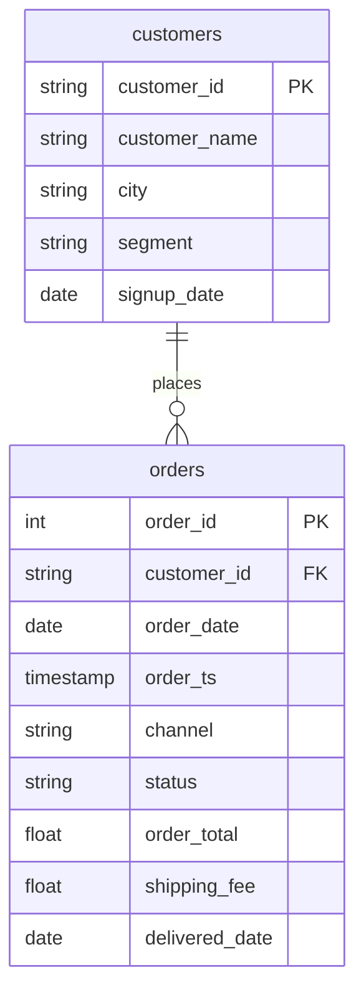

# Join Nakheel orders to customers

In this activity, you will join 3,000 Nakheel orders to their customers, find the one order that does not survive an `INNER JOIN`, and see why a `LEFT JOIN` keeps it.

**Time:** 10 minutes · **Data:** `nakheel.orders`, `nakheel.customers` · **Starter:** `Unsolved/orders_to_customers.sql`

## How the tables connect

Join key: `orders.customer_id = customers.customer_id`.

PK is the primary key: it names one row. FK is a foreign key: it points to a row in another table. The line between two tables shows the join: the end with two short bars is the "one" side, and the end that splits into a fork is the "many" side.

## Instructions

Before you start, run the Five Checks for `orders` and `customers`. Is `customer_id` unique in `customers`? `COUNT(*)` and `COUNT(DISTINCT customer_id)` on `customers` should both be 500.

1. Count the orders.
2. Count the rows after `orders INNER JOIN customers`.
3. Count the rows after `orders LEFT JOIN customers`.
4. Find the order the `INNER JOIN` dropped: after the `LEFT JOIN`, its customer columns are `NULL`.

    Translate: the `LEFT JOIN` from query 3, then `WHERE c.customer_id IS NULL`. Test the key, not `city`: six Nakheel customers have no city, so `WHERE c.city IS NULL` also returns their orders, 39 rows in all.

## Check yourself

| Query | Rows returned | One value to check |
|---|---:|---|
| 1 | 1 | 3,000 |
| 2 | 1 | 2,999 |
| 3 | 1 | 3,000 |
| 4 | 1 | order 101664, customer C-0999, 938.00 |

If query 3 returns 3,038 rows, `customers` is on the left: that keeps every customer, including the ones with no orders. Put `orders` first: `FROM nakheel.orders AS o LEFT JOIN nakheel.customers AS c`.

## Why it matters

Order 101664 is a completed order worth 938 dinars whose customer is not in `customers`. Any report that joins orders to customers with `INNER JOIN` silently leaves out that revenue. A real system has rows like this: a deleted account, a test customer, a typing error at the till.

## References

Nakheel Retail, course-owned synthetic data generated 24 September 2026. See [the dataset README](../../D04/03-Evr-Upload-Nakheel/Resources/README.md).
