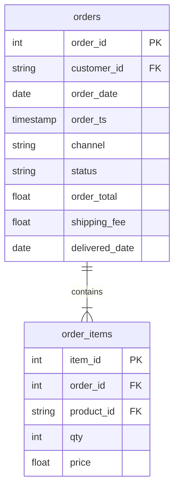

# Audit the join

In this activity, you will join Nakheel orders to their order lines and fill in an audit table, before and after, to find which number the join changed.

**Time:** 15 minutes · **Data:** `nakheel.orders`, `nakheel.order_items` · **Starter:** `Unsolved/join_audit.sql`

## How the tables connect

Join key: `order_items.order_id = orders.order_id`.

PK is the primary key: it names one row. FK is a foreign key: it points to a row in another table. The line between two tables shows the join: the end with two short bars is the "one" side, and the end that splits into a fork is the "many" side.

## Instructions

Before you start, run the Five Checks for `orders` and `order_items`. Which is the "one" side? Predict how many rows the join returns.

1. Before the join, on `orders`: the row count, the number of different orders, and `SUM(order_total)`.

2. After `orders INNER JOIN order_items`: the same three numbers. Fill in the audit table at the top of the starter file. Which number stayed the same? Which grew, and by how much?

3. After the join, sum `qty * price` instead. Compare it with question 1.

## Check yourself

| Question | Rows returned | One value to check |
|---|---:|---|
| 1 | 1 | 3,000 rows; 3,000 orders; 340,370.00 |
| 2 | 1 | 7,516 rows; 3,000 orders; 1,067,249.00 |
| 3 | 1 | 340,370.00 |

If rows or totals differ, check the `ON` condition and which table supplied the amount you summed.

## Hint

`order_total` is stored once per order. After the join, an order with three lines appears on three rows, and its `order_total` appears three times.

## Bonus

Which order had its total copied onto the most rows? Expect one row. Many orders tie at six lines, so add `order_id` as a second sort column to get the same answer as everyone else: order 100013.

## References

Nakheel Retail, course-owned synthetic data generated 24 September 2026. See [the dataset README](../../D04/03-Evr-Upload-Nakheel/Resources/README.md).
