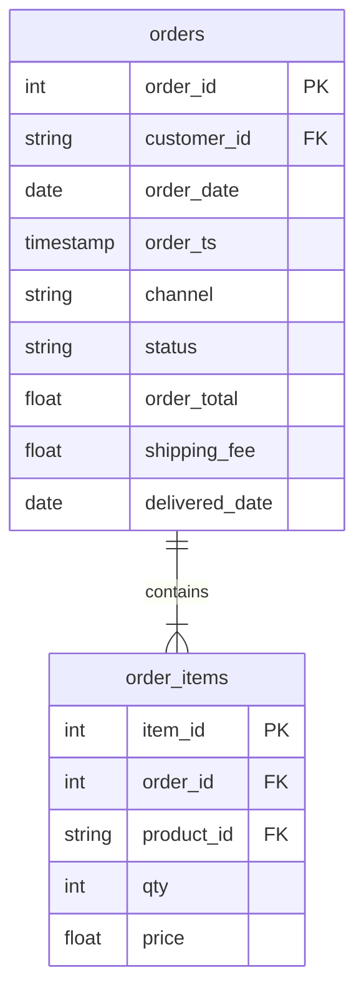

# Sum each amount where it lives

In this activity, you will see a join inflate revenue by channel about three times, fix it two ways, and count orders correctly after the join.

**Time:** 15 minutes · **Data:** `nakheel.orders`, `nakheel.order_items` · **File:** `Solved/sum_where_it_lives.sql`

The question: "Completed revenue by channel." The amount (`order_total`) and the channel are both on `orders`. Reports often join `order_items` anyway, because they need a line column too, such as units or product. This activity shows what that join does to `order_total`.

## How the tables connect

Join key: `order_items.order_id = orders.order_id`.

PK is the primary key: it names one row. FK is a foreign key: it points to a row in another table. The line between two tables shows the join: the end with two short bars is the "one" side, and the end that splits into a fork is the "many" side.

## Instructions

1. Open `Solved/sum_where_it_lives.sql`. Run query 1, the inflated version: `SUM(o.order_total)` after `orders INNER JOIN order_items`.

    You should see online 351,733.50 and store 637,238.00. That is about three times the truth, and nothing warns you. After the join, one row is one order line, and each order's `order_total` is copied onto every one of its lines.

2. Run query 2, fix 1: sum the amount that is stored at the grain of the joined rows, `SUM(i.qty * i.price)`.

    You should see online 110,685.50 and store 205,338.00. `qty * price` is stored on each line, and after the join one row is one line, so each value is counted once.

3. Run query 3, fix 2: sum `order_total` on `orders` alone, with no join.

    You should see the same two numbers. Which fix would you use? If the report needs nothing from `order_items`, fix 2: no join, nothing to inflate.

4. Run query 4. It counts after the join two ways. `COUNT(*)` gives 2,535 (online) and 4,416 (store): those are lines. `COUNT(DISTINCT o.order_id)` gives 1,008 and 1,763: those are orders.

5. Run queries 5a and 5b. `shipping_fee` also lives on `orders`, so it inflates in exactly the same way. For completed orders, 5a sums it after the join and gets 1,742.50; 5b sums it on `orders` alone and gets 1,032.50.

6. Write the rule in your own `.sql` file as a comment: **sum an amount at the table where it lives, or prove the join did not change that table's grain.** To know where an amount lives, look at the table's grain: `order_total` is one value per order, so it lives on `orders`. The [dataset README](../../D04/03-Evr-Upload-Nakheel/Resources/README.md) says which table each column is on.

## Check yourself

| Query | Rows returned | One value to check |
|---|---:|---|
| 1 | 2 | online 351,733.50; store 637,238.00 (inflated) |
| 2 | 2 | online 110,685.50; store 205,338.00 |
| 3 | 2 | the same as query 2 |
| 4 | 2 | online 2,535 rows, 1,008 orders |
| 5a | 1 | 1,742.50 after the join |
| 5b | 1 | 1,032.50 on `orders` alone |

BigQuery may show money as `351733.5` rather than `351,733.50`. The numbers are the same.

## References

Nakheel Retail, course-owned synthetic data generated 24 September 2026. See [the dataset README](../../D04/03-Evr-Upload-Nakheel/Resources/README.md).
