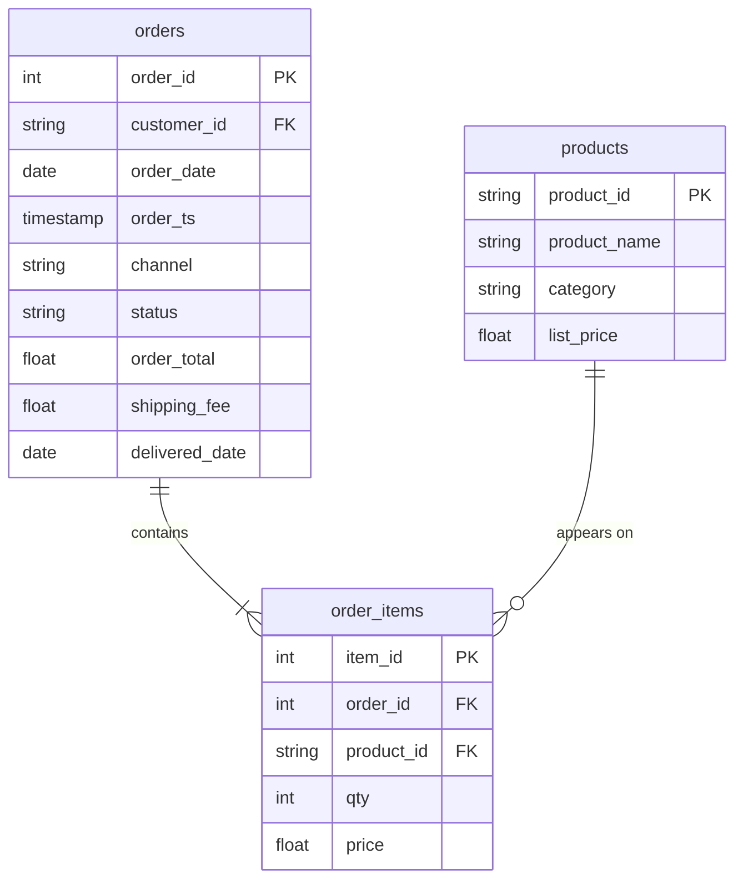

# Lab: Revenue by category, with a join audit

In this lab, you will answer the question the D04 managers could not get answered, "which product category brings in the most revenue?", and prove with an audit table that no join changed the total.

**Time:** about 35 minutes in class, then finish after class · **Data:** `nakheel.order_items`, `nakheel.products`, `nakheel.orders` · **Starter:** `Unsolved/category_revenue.sql`

**Before you start:** the four `nakheel` tables are uploaded. If they are missing, use the [D04 Nakheel upload activity](../../D04/03-Evr-Upload-Nakheel/README.md).

**When:** you start the lab in class and finish it after class. The Solved folder is released afterwards.

**What you hand in:** nothing. Save your `.sql` file with the audit table filled in. It is the third of the files you choose from for Assignment 1, which is issued on D09 (Sunday 11 October).

## How the tables connect

Join keys: `order_items.order_id = orders.order_id` and `order_items.product_id = products.product_id`.

PK is the primary key: it names one row. FK is a foreign key: it points to a row in another table. The line between two tables shows the join: the end with two short bars is the "one" side, and the end that splits into a fork is the "many" side.

## The audit table

After every join, record the numbers and say whether each should have changed. The same table is at the top of the starter file:

| Step | Rows | `SUM(qty * price)` |
|---|---:|---:|
| `order_items` alone (step 2) | | |
| + `products` (step 3) | | |
| + `orders` (step 5) | | |
| completed only (step 6) | | |
| `orders` table, completed only (step 7, `SUM(order_total)`) | – | |

If a number changed and you cannot say why, stop and find out before you go on.

## C1 · Two tables: revenue by category

1. Run the Five Checks for `order_items` and `products`. Is `product_id` unique in `products`? Prove it with `COUNT(*)` and `COUNT(DISTINCT product_id)`.
2. Audit, before: the rows in `order_items` and `SUM(qty * price)`.
3. Audit, after `order_items INNER JOIN products`: the same two numbers.
4. "Which product category has brought in the most revenue?" All orders for now. Group by `category`.

**Checkpoint C1:** the audit shows 7,516 rows and 340,370.00 before and after the join, and the query returns 6 categories.

## C2 · Three tables: completed orders

5. Join `orders` as well, to get each line's `status`. Audit: rows and total.
6. Keep completed orders only. Audit again.
7. Cross-check the total against the orders table on its own: `SUM(order_total)` for completed orders, with no join. The two totals must be equal.
8. "Over the whole two years, which category brings in the most completed revenue?"

    Translate: completed orders; group by category; sum `i.qty * i.price`.

**Checkpoint C2:** the completed total after the joins equals the orders table's completed total, and Outerwear is first.

## C3 · By category and month

9. "Show me completed revenue for each category, month by month."

    Translate: the query from step 8, grouped by category and by `DATE_TRUNC(o.order_date, MONTH)`.

**Checkpoint C3:** 144 rows: 6 categories × 24 months.

## Check yourself

| Step | Rows returned | One value to check |
|---|---:|---|
| 1 | 1 | 60 and 60: unique |
| 2 | 1 | 7,516 rows; 340,370.00 |
| 3 | 1 | 7,516 rows; 340,370.00 |
| 4 | 6 | Outerwear first, 81,920.50 |
| 5 | 1 | 7,516 rows; 340,370.00 |
| 6 | 1 | 6,951 rows; 316,023.50 |
| 7 | 1 | 316,023.50 |
| 8 | 6 | Outerwear first, 76,637.00 |
| 9 | 144 | September 2024, Outerwear: 3,068.00 |

If an audit number changes unexpectedly, check the `ON` condition and the source of the amount before grouping.

## Hint

In C2, write the joins first and check the audit before you add `WHERE` and `GROUP BY`. With three tables, give each a short name: `order_items AS i`, `products AS p`, `orders AS o`.

## Stretch card

Not required, not checked. `bigquery-public-data.thelook_ecommerce` has `order_items` and `products` tables too. First check that `id` is unique in `products`. Then read the bytes estimate, and calculate revenue (`sale_price`) by product category for order items with `status = 'Complete'`. The public data changes, so there is no fixed answer.

## More practice

**Not checked and not submitted.** Solutions are in the Solved file. Each join question needs its own audit.

- X1 "Units sold per category, completed orders."
- X2 "Omar Nasser from Irbid has two customer IDs. What has he spent on completed orders under each ID? Add the two rows to get his total."
- X3 Transfer: in `thelook_ecommerce`, orders per user country. Read the bytes estimate before you run.

## Check yourself: more practice

| Question | Rows returned | One value to check |
|---|---:|---|
| X1 | 6 | Sportswear first, 3,408 units |
| X2 | 2 | C-1204: 3 orders, 143.00; C-1401: 18 orders, 6,033.00; in total 21 orders, 6,176.00 |

X3 uses public data that changes, so it has no fixed answer.

## If something goes wrong

| Problem | Fix |
|---|---|
| `Column name customer_id is ambiguous` (or `order_id`, `product_id`) | Both tables have that column. Prefix it with the alias: `o.order_id` |
| The audit total grows after a join | You are summing an amount from the "one" side after joining the "many" side. Sum the line amount, `i.qty * i.price`, instead |
| After the completed filter the audit still shows 7,516 rows and 340,370.00 | The `WHERE o.status = 'completed'` is missing from that audit query |
| The step 9 result has 24 rows, not 144 | You grouped by month only. Add `p.category` to `GROUP BY` |
| The result has far more rows than expected | Check the `ON` condition: joining on the wrong column pairs rows that do not belong together |

## References

Nakheel Retail, course-owned synthetic data generated 24 September 2026 ([dataset record](../../D04/03-Evr-Upload-Nakheel/Resources/README.md)).
