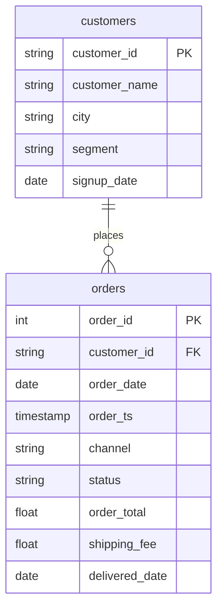

# COUNT(*) against COUNT(column) after a LEFT JOIN

In this activity, you will count each customer's orders with a `LEFT JOIN` and see why `COUNT(*)` gives a customer with no orders a count of 1.

**Time:** 12 minutes · **Data:** `nakheel.customers`, `nakheel.orders` · **Starter:** `Unsolved/count_after_left_join.sql`

## How the tables connect

Join key: `orders.customer_id = customers.customer_id`.

PK is the primary key: it names one row. FK is a foreign key: it points to a row in another table. The line between two tables shows the join: the end with two short bars is the "one" side, and the end that splits into a fork is the "many" side.

## Instructions

1. "How many orders has each customer placed? Include the ones with none." Which join keeps every customer? What is one row of the result?

    Translate: `customers LEFT JOIN orders`, `GROUP BY c.customer_id`. Show both `COUNT(*)` and `COUNT(o.order_id)`. Sort by the order count, smallest first, then by `customer_id`. Look at the first rows.

2. Change the sort to `ORDER BY rows_counted, c.customer_id` and look at the first rows again. Every customer with no orders and every customer with exactly one order now shows 1 in `rows_counted`: 39 plus 126 customers, 165 rows that look the same. A report built on `COUNT(*)` would say nobody has zero orders. Put the sort back.

3. For the whole join, in one row: the number of rows, the number of orders found, and the number of different customers. Predict all three first.

## Check yourself

| Step | Rows returned | One value to check |
|---|---:|---|
| 1 | 500 | C-1013 first: `COUNT(*)` 1, `COUNT(o.order_id)` 0 |
| 3 | 1 | 3,038 rows; 2,999 orders; 500 customers |

In step 3, 3,038 is the 2,999 matched orders plus the 39 customers with none. The orphan order 101664 from D06 has no customer, so a join from `customers` never reaches it.

## Why

A `LEFT JOIN` keeps a customer with no orders as one row, with `NULL` in every order column. `COUNT(*)` counts that row. `COUNT(o.order_id)` skips the `NULL` and gives 0, which is the true number of orders.

## Hint

Count a column from the right-hand table. `COUNT(c.customer_id)` counts a column of the left table, which is never empty, so it gives the same wrong 1 as `COUNT(*)`.

## References

Nakheel Retail, course-owned synthetic data generated 24 September 2026. See [the dataset README](../../D04/03-Evr-Upload-Nakheel/Resources/README.md).
