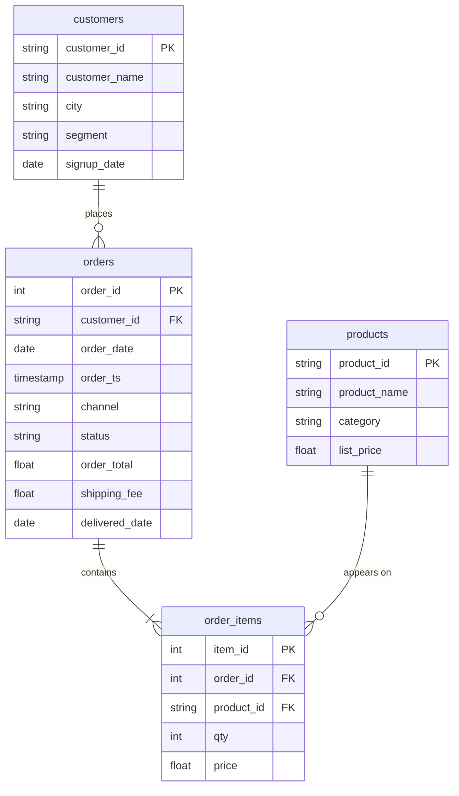

# Never ordered, never sold

In this activity, you will find the customers who have never placed an order and the products that have never been sold, using a `LEFT JOIN` and `IS NULL`.

**Time:** 10 minutes · **Data:** `nakheel.customers`, `nakheel.orders`, `nakheel.products`, `nakheel.order_items` · **Starter:** `Unsolved/never_ordered.sql`

## How the tables connect

Join keys: `orders.customer_id = customers.customer_id`, `order_items.order_id = orders.order_id` and `order_items.product_id = products.product_id`.

PK is the primary key: it names one row. FK is a foreign key: it points to a row in another table. The line between two tables shows the join: the end with two short bars is the "one" side, and the end that splits into a fork is the "many" side.

## Instructions

1. "Which customers have signed up but never placed an order? The marketing team wants to contact them."

    Translate: `customers LEFT JOIN orders`, keep the rows where the order side is empty.

2. "Which products have never sold? The buying team is deciding whether to stop stocking them."

    Translate: `products LEFT JOIN order_items`, keep the rows where the item side is empty.

## Check yourself

| Question | Rows returned | One value to check |
|---|---:|---|
| 1 | 39 | C-1013, Anas Abbadi, is first by ID |
| 2 | 4 | P-009, Hiking boot |

## Hint

After a `LEFT JOIN`, test a column from the right-hand table that is never empty in real rows, such as its key: `WHERE o.order_id IS NULL`.

## Bonus

How many of the never-ordered customers are in each city, as typed? Expect 9 rows.

## References

Nakheel Retail, course-owned synthetic data generated 24 September 2026. See [the dataset README](../../D04/03-Evr-Upload-Nakheel/Resources/README.md).
