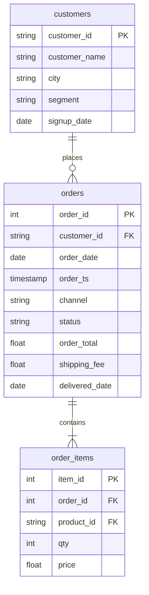

# The join family: RIGHT, FULL and the no-match joins

In this activity, you will compare the four joins by the rows each one keeps, see that a `RIGHT JOIN` is a `LEFT JOIN` with the tables swapped, and find the rows with no match on either side.

**Time:** 10 minutes · **Data:** `nakheel.customers`, `nakheel.orders`, `nakheel.order_items` · **File:** `Solved/right_full_subquery.sql`

You will read these joins more often than you write them. Most analysts write `LEFT JOIN` and put the table they want to keep first.

## How the tables connect

Join keys: `orders.customer_id = customers.customer_id` and `order_items.order_id = orders.order_id`.

PK is the primary key: it names one row. FK is a foreign key: it points to a row in another table. The line between two tables shows the join: the end with two short bars is the "one" side, and the end that splits into a fork is the "many" side.

## Every join keeps the matches

Picture two circles of `customer_id` values: the left circle holds the keys in `customers`, the right circle the keys in `orders`, and the overlap the keys in both. Each join keeps a different part. Customers are written first every time.

| Join | Keeps | Rows at Nakheel |
|---|---|---:|
| `INNER JOIN` | the overlap: customers with orders | 2,999 |
| `LEFT JOIN` | the whole left circle: every customer | 3,038 |
| `RIGHT JOIN` | the whole right circle: every order | 3,000 |
| `FULL OUTER JOIN` | both circles | 3,039 |

The circles show which keys survive. They do not count rows: C-118 is one key in the circles but two rows after the join, one per order. To count rows, use the match board from D06: rows out = the matching lines, plus the unmatched rows the join keeps.

## Instructions

1. Open `Solved/right_full_subquery.sql`. Run queries 1 and 2. `orders RIGHT JOIN customers` and `customers LEFT JOIN orders` both return 3,038 rows. A `RIGHT JOIN` keeps every row of the table written second, so swapping the tables turns it into a `LEFT JOIN`.

2. Run query 3: `customers RIGHT JOIN orders`. Now every order is kept: the 2,999 matched orders plus order 101664, whose customer C-0999 is not in `customers` (you met it on D06 in [Join Nakheel orders to customers](../../D06/05-Evr-Orders-to-Customers/README.md)). 3,000 rows.

3. Run query 4: `FULL OUTER JOIN` keeps the unmatched rows from both sides. You should see 3,039 rows, 39 customers without orders and 1 order without a customer. `COUNTIF` counts the rows where its condition is true; it is a BigQuery function, and other databases write `COUNT(CASE WHEN … THEN 1 END)`.

4. Run query 5: `LEFT JOIN`, then `WHERE o.order_id IS NULL`. Only the customers with no order are left: 39, the list from [Never ordered, never sold](../02-Stu-Never-Ordered/README.md). Power Query calls this a **left anti join**.

5. Run query 6: the same idea from the other side keeps the one order with no customer, 101664. That is a **right anti join**.

6. Optional, a preview of D08: run query 7, completed revenue and units by channel. It adds up `order_items` to one row per order first, inside brackets, then joins to `orders`, keeps completed orders and groups by `channel`. Both sides then have one row per order, so `order_total` is not copied. Look at the result; you learn to write the query inside brackets (a subquery) on D08.

## Check yourself

| Query | Rows returned | One value to check |
|---|---:|---|
| 1 | 1 | 3,038 |
| 2 | 1 | 3,038 |
| 3 | 1 | 3,000 |
| 4 | 1 | 3,039 rows; 39 customers without orders; 1 order without a customer |
| 5 | 1 | 39 |
| 6 | 1 | order 101664, customer C-0999 |
| 7 | 2 | online 110,685.50 and 6,417 units; store 205,338.00 and 11,691 units |

## References

Nakheel Retail, course-owned synthetic data generated 24 September 2026. See [the dataset README](../../D04/03-Evr-Upload-Nakheel/Resources/README.md).
