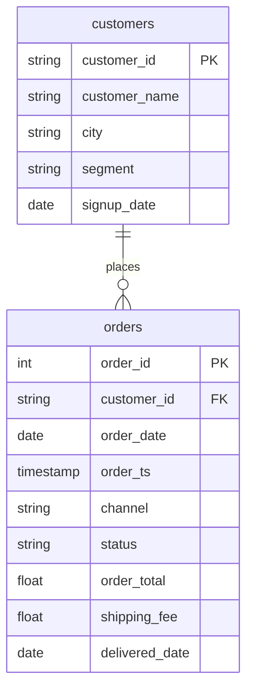

# A cleaning rule of your own

In this activity, you will report completed revenue by city after a join, and write your own cleaning rule as a `CASE` for the spellings that `LOWER` and `TRIM` cannot fix.

**Time:** 12 minutes · **Data:** `nakheel.orders`, `nakheel.customers` · **Starter:** `Unsolved/city_rule.sql`

## How the tables connect

Join key: `orders.customer_id = customers.customer_id`.

PK is the primary key: it names one row. FK is a foreign key: it points to a row in another table. The line between two tables shows the join: the end with two short bars is the "one" side, and the end that splits into a fork is the "many" side.

## Instructions

1. "Completed revenue by city." Nakheel has 8 cities. Predict the row count, then count completed orders by city as typed.

    Translate: `orders LEFT JOIN customers` (the join from [Group by a column from the other table](../04-Ins-Segment-After-Join/README.md)), completed orders only, `GROUP BY c.city`.

    Look at the result. `Amman` and `amman` are two groups, `Zarqa` and `Al Zarqa` are two more, and there is a `NULL` group: customers with no city, plus order 101664, which has no customer at all.

2. `LOWER(TRIM(...))` fixes `amman` (you used it on D04 in [Clean text in one line](../../D04/09-Ins-Clean-Text/README.md)). It cannot know that `Al Zarqa` is Zarqa. That needs a rule you write yourself. Write it in words first, as a comment:

    - no city at all → `unknown`
    - `Al Zarqa` → `zarqa`
    - everything else → trimmed and lower-case

3. Write the rule as a `CASE` column called `city_clean`, and report completed orders and revenue by `city_clean`, largest revenue first.

    Translate: three lines in the `CASE`, in the order of your rule; `GROUP BY city_clean`; `ROUND(SUM(o.order_total), 2)`.

4. Why do you need the `WHEN c.city IS NULL` line? `LOWER(TRIM(NULL))` is `NULL`, so without it the `ELSE` line returns `NULL`, not `unknown`. Putting the test for a missing value first is a good habit. In this rule no city can pass two tests, so moving the `IS NULL` line below the `Al Zarqa` line gives the same 9 rows. The order matters when two tests can both be true: `CASE` stops at the first true line, which is why D04's size band tests `>= 200` before `>= 50`.

## Check yourself

| Step | Rows returned | One value to check |
|---|---:|---|
| 1 | 11 | the `NULL` group has 37 orders |
| 3 | 9 | amman first: 1,064 orders, 130,848.00; zarqa 284 orders; unknown 37 orders, 3,197.00 |

In step 3, 10 rows means the `Al Zarqa` line is missing. A blank row instead of `unknown` means the `IS NULL` line is missing.

## Hint

A `CASE` can use a function inside its test: `WHEN LOWER(TRIM(c.city)) = 'al zarqa' THEN 'zarqa'`.

## References

Nakheel Retail, course-owned synthetic data generated 24 September 2026. See [the dataset README](../../D04/03-Evr-Upload-Nakheel/Resources/README.md).
