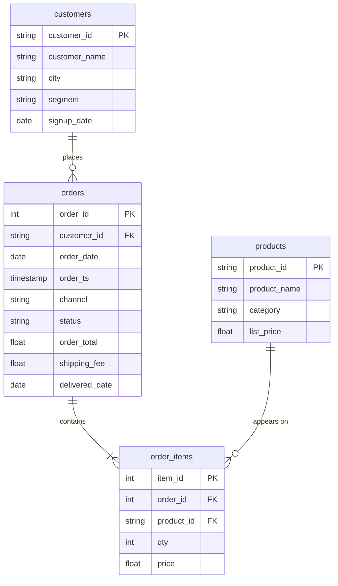

# Category by segment, four tables

In this activity, you will join four tables to report completed units and revenue by product category and customer segment, audit the join, and keep only the combinations worth more than 20,000.

**Time:** 18 minutes · **Data:** `nakheel.order_items`, `nakheel.products`, `nakheel.orders`, `nakheel.customers` · **Starter:** `Unsolved/category_by_segment.sql`

## How the tables connect

Join keys: `orders.customer_id = customers.customer_id`, `order_items.order_id = orders.order_id` and `order_items.product_id = products.product_id`.

PK is the primary key: it names one row. FK is a foreign key: it points to a row in another table. The line between two tables shows the join: the end with two short bars is the "one" side, and the end that splits into a fork is the "many" side.

## Instructions

Before you start, answer three questions in a comment: which table has the amount, which has the category, and which has the segment? Then: how do you get from an order line to a customer? Start from `order_items`, because it has the amounts. Audit before you group.

1. Join `products`, `orders` and `customers` to `order_items`, keep completed orders, and record the audit: the number of rows and `SUM(i.qty * i.price)`. Compare the total with completed `SUM(order_total)` on `orders` alone, which you found in [Group by a column from the other table](../04-Ins-Segment-After-Join/README.md).

    Translate: line → product on `product_id`; line → order on `order_id`; order → customer on `customer_id`. Use `LEFT JOIN` for `customers`, so order 101664, which has no customer, stays in.

2. "Show me completed units and revenue for every product category and customer segment." Say what one row is and predict the row count before you run.

    Translate: clean the segment with `COALESCE(LOWER(TRIM(c.segment)), 'unknown')`; `GROUP BY` category and cleaned segment; `SUM(i.qty)` and `SUM(i.qty * i.price)`; largest revenue first.

3. "Only the combinations worth more than 20,000."

## Check yourself

| Question | Rows returned | One value to check |
|---|---:|---|
| 1 | 1 | 6,951 rows; 316,023.50 |
| 2 | 16 | Outerwear, retail first: 1,403 units, 41,238.00 |
| 3 | 10 | the last row is Sportswear, wholesale, 20,580.50 |

If your revenue is about three times too big, you summed `o.order_total`. What is one row after the join? If question 2 has 12 rows, look for the order with no customer.

## Hint

The test in question 3 is on a group's total, so it goes in `HAVING`. `WHERE SUM(...) > 20000` fails, because there are no groups yet when `WHERE` runs.

## Bonus

Not required, not checked. "For each category, what share of completed revenue comes from wholesale customers?" Use a `CASE` inside `SUM` that keeps a line's value only when the cleaned segment is `wholesale`, and 0 otherwise. Expect 6 rows; Shoes has the largest wholesale share, 53.5%.

## References

Nakheel Retail, course-owned synthetic data generated 24 September 2026. See [the dataset README](../../D04/03-Evr-Upload-Nakheel/Resources/README.md).
