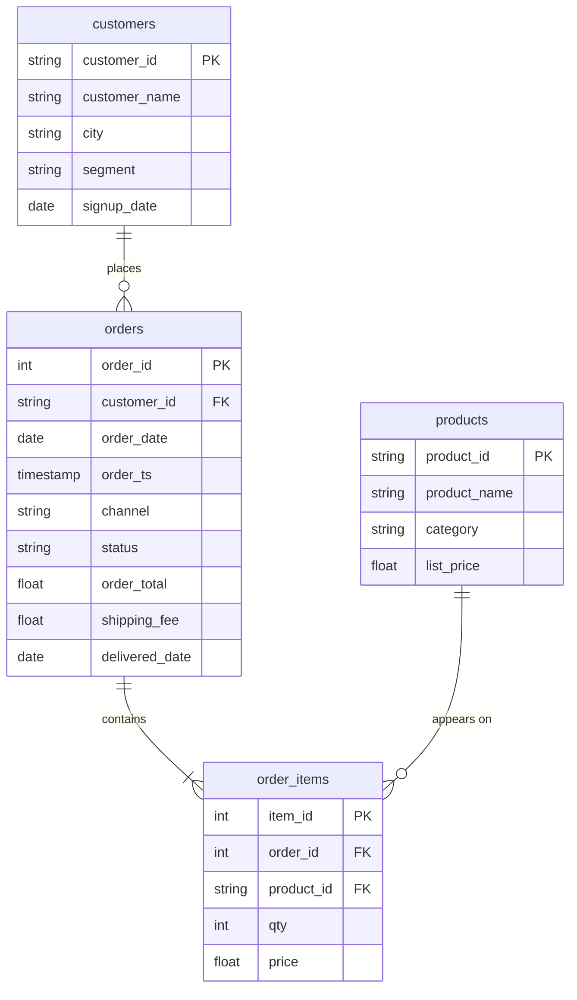

# Lab: A joined report with an audit

In this lab, you will build one report on Nakheel that uses all of D06 and D07: completed revenue by cleaned customer segment and channel, the D04 size band with a `HAVING` test, and one list of everything with no match, with an audit before any grouping.

**Time:** about 35 minutes in class, then finish after class · **Data:** `nakheel.orders`, `nakheel.customers`, `nakheel.products`, `nakheel.order_items` · **Starter:** `Unsolved/joined_report.sql`

**Before you start:** the four `nakheel` tables are uploaded. If they are missing, use the [D04 Nakheel upload activity](../../D04/03-Evr-Upload-Nakheel/README.md). For the more practice question X3 you also need the `pagila` tables from [A bridge table: films per category](../08-Evr-Films-Per-Category/README.md).

**When:** you start the lab in class and finish it after class. The Solved folder is released afterwards.

**What you hand in:** nothing. Save your `.sql` file with the audit table filled in. It is the fourth of the files you choose from for Assignment 1, which is issued on D09 (Sunday 11 October).

## How the tables connect

Join keys: `orders.customer_id = customers.customer_id`, `order_items.order_id = orders.order_id` and `order_items.product_id = products.product_id`.

PK is the primary key: it names one row. FK is a foreign key: it points to a row in another table. The line between two tables shows the join: the end with two short bars is the "one" side, and the end that splits into a fork is the "many" side.

## The audit table

Before you group anything, record these numbers and say whether each should have changed:

| Step | Rows | Different orders | `SUM(order_total)` |
|---|---:|---:|---:|
| `orders`, completed only | | | |
| after `LEFT JOIN customers` | | | |

If a number changed and you cannot say why, stop and find out before you go on.

## C1 · Audit, then segment by channel

1. Audit, before: the number of completed orders and their `SUM(order_total)`, on `orders` alone.
2. Run the Five Checks for `orders` and `customers`. Then audit, after `orders LEFT JOIN customers`, completed orders only: the rows, the different orders and the total.
3. "Completed revenue by customer segment and channel." Clean the segment as in [Group by a column from the other table](../04-Ins-Segment-After-Join/README.md), and give the order with no customer the label `unknown`. Show the number of completed orders and the revenue. Largest revenue first.

**Checkpoint C1:** the audit shows 2,771 orders and 316,023.50 before and after the join, and the report has 5 rows.

## C2 · Size band and HAVING

4. "Split each segment by order size." Use the D04 rule: an order is large from 200, medium from 50, otherwise small. One row is one segment and band. Largest revenue first.
5. "Only the groups worth more than 20,000." Which groups remain? Write one sentence on what that says about retail's large orders and wholesale's.

**Checkpoint C2:** 7 rows in step 4, 3 rows in step 5.

## C3 · Everything with no match, in one list

6. "One list of every customer who has never ordered and every product that has never sold." Each half returns three columns, `gap_type` (the text `'customer'` or `'product'`), `id` and `name`. Stack the halves with `UNION ALL` and sort by `gap_type`, then `id`.

    Translate: the two queries from [Never ordered, never sold](../02-Stu-Never-Ordered/README.md), each with a text column added; `UNION ALL` between them; one `ORDER BY` at the end.

**Checkpoint C3:** 43 rows: 39 customers and 4 products.

## Check yourself

| Step | Rows returned | One value to check |
|---|---:|---|
| 1 | 1 | 2,771 orders; 316,023.50 |
| 2 | 1 | 2,771 rows; 2,771 orders; 316,023.50 |
| 3 | 5 | wholesale, store first: 257 orders, 103,069.00; unknown, online last: 938.00 |
| 4 | 7 | wholesale, large first: 264 orders, 141,847.50 |
| 5 | 3 | wholesale large; retail medium; retail small |
| 6 | 43 | the first product row is P-009, Hiking boot |

If an audit number changes unexpectedly, check the join type and the `ON` condition before grouping.

## Hint

In step 2, `COUNT(*)` and `COUNT(DISTINCT o.order_id)` should be equal. If they are, the join did not copy any order. In step 6, both halves of a `UNION ALL` must return the same columns in the same order; the column names come from the first half.

## Stretch card

Not required, not checked. `bigquery-public-data.thelook_ecommerce` has `users` and `orders` tables. First check that `id` is unique in `users`. Then read the bytes estimate, and count the users who have never placed an order, by `traffic_source`. The public data changes, so there is no fixed answer.

## More practice

**Not checked and not submitted.** Solutions are in the Solved file. Each join question needs its own audit.

- X1 "How many customers who never ordered does each city have?" Group by the city as typed.
- X2 "Completed revenue by customer segment." Clean the segment with `LOWER(TRIM(...))` and use an `INNER JOIN` to customers. Audit: which completed order does the `INNER JOIN` lose, and what is it worth?
- X3 Pagila: films per rating, with the average running time.

## Check yourself: more practice

| Question | Rows returned | One value to check |
|---|---:|---|
| X1 | 9 | Amman 15 |
| X2 | 2 | retail 160,881.50; wholesale 154,204.00 |
| X2a | 1 | order 101664, 938.00 |
| X3 | 5 | PG-13: 223 films |

## If something goes wrong

| Problem | Fix |
|---|---|
| Step 2 shows 2,770 rows and 315,085.50 | An `INNER JOIN` lost order 101664. Use `LEFT JOIN` |
| Step 3 shows a blank segment row | `COALESCE(…, 'unknown')` is missing |
| Step 5 stops with an error about an aggregate in `WHERE` | The test on the sum was written in `WHERE`. It belongs in `HAVING` |
| Step 6 stops with a column-count error | Both halves of the `UNION ALL` must return the same three columns in the same order |
| `Column name customer_id is ambiguous` | Prefix it with the alias: `o.customer_id` |

## References

Nakheel Retail, course-owned synthetic data generated 24 September 2026 ([dataset record](../../D04/03-Evr-Upload-Nakheel/Resources/README.md)). Pagila sample database, copyright Devrim Gündüz, [github.com/devrimgunduz/pagila](https://github.com/devrimgunduz/pagila), commit 9baf49c; course copy taken 24 September 2026 ([`Resources/README.md`](../08-Evr-Films-Per-Category/Resources/README.md)).
