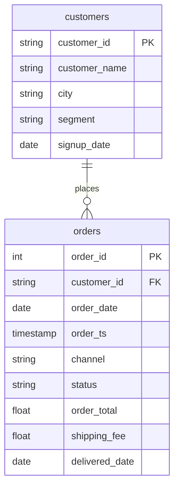

# A list from another table, with IN

In this activity, you will count the completed orders from wholesale customers with a subquery that returns a list of customers, test against that list with `IN`, and check the answer against the D07 join.

**Time:** 13 minutes · **Data:** `nakheel.orders`, `nakheel.customers` · **Starter:** `Unsolved/subquery_in.sql`

"How many completed orders came from wholesale customers, and what were they worth?" Before you start, write two answers in a comment: which table knows who is wholesale, and which table has the orders?

## How the tables connect

Join key: `orders.customer_id = customers.customer_id`.

PK is the primary key: it names one row. FK is a foreign key: it points to a row in another table. The line between two tables shows the join: the end with two short bars is the "one" side, and the end that splits into a fork is the "many" side.

## Instructions

1. The inner query alone: "Which customers are wholesale?" Predict the row count, then run.

    Translate: `customer_id` from `customers`, where the cleaned segment is `'wholesale'`. Clean it with `LOWER(TRIM(segment))`, as on D04.

    You should see 65 rows. This is a list, not one number.

2. Use the list in the outer query. Count the completed orders and add up their `order_total`, keeping only the orders whose `customer_id` is in the list.

    Translate: `WHERE status = 'completed' AND customer_id IN (` the query from step 1 `)`.

    `IN` keeps a row when its value is anywhere in the list. You should see 377 orders and 154,204.00, the wholesale figure from [Group by a column from the other table](../../D07/04-Ins-Segment-After-Join/README.md).

3. The same answer with a join, as on D07: `orders INNER JOIN customers`, completed orders, cleaned segment `'wholesale'`. You should see 377 orders and 154,204.00 again.

4. Go back to step 2, change `IN` to `=` and run. You should see an error: `Scalar subquery produced more than one element`. `=` needs exactly one value, and the inner query returned 65. Put `IN` back.

5. Which would you write? Both are right. The subquery reads as "orders whose customer is in the wholesale list". The join brings the customer's columns along, which you need if the report shows the customer's name or city. When you only filter, `IN` is often easier to read.

## Check yourself

| Step | Rows returned | One value to check |
|---|---:|---|
| 1 | 65 | a list of `customer_id` values |
| 2 | 1 | 377 orders; 154,204.00 |
| 3 | 1 | 377 orders; 154,204.00 |

If step 1 returns 61 or 4 rows, the segment was compared as typed: the data has both `Wholesale` (61 customers) and `wholesale` (4). Compare `LOWER(TRIM(segment))` with `'wholesale'`. If it returns 0 rows, check for a capital letter inside the quotes.

## Hint

Write the inner query first and run it alone. Then type the outer query around it, and paste the inner query inside the brackets after `IN`.

## References

Nakheel Retail, course-owned synthetic data generated 24 September 2026. See [the dataset README](../../D04/03-Evr-Upload-Nakheel/Resources/README.md).
