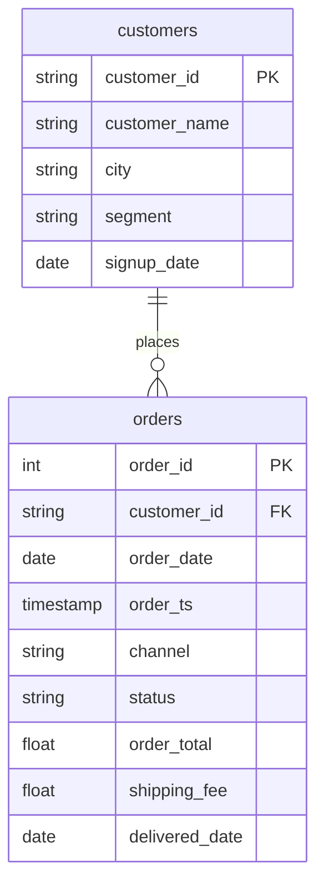

# From nested to named

In this activity, you will answer "What does a typical customer who has bought from us spend, in each segment?" first with a query nested inside another, then with a CTE that names each step and reads from top to bottom.

**Time:** 12 minutes · **Data:** `nakheel.orders`, `nakheel.customers` · **File:** `Solved/nested_to_named.sql`

Can one `GROUP BY` answer this question? No. It needs two grains: first one row per customer (what each customer spent), then one row per segment (the average of those customers).

"Customers who have bought from us" means customers with at least one completed order. The 49 customers with none are not in step 1, so they are not in the average.

## How the tables connect



Join key: `orders.customer_id = customers.customer_id`.

PK is the primary key: it names one row. FK is a foreign key: it points to a row in another table. The line between two tables shows the join: the end with two short bars is the "one" side, and the end that splits into a fork is the "many" side.

## Instructions

1. Step 1 alone: completed revenue per customer. Say what one row is (one customer) and predict the row count. Type and run:

    ```sql
    SELECT customer_id,
           COUNT(*) AS completed_orders,
           SUM(order_total) AS revenue
    FROM nakheel.orders
    WHERE status = 'completed'
    GROUP BY customer_id;
    ```

    You should see 452 rows, not 500. They are 451 customers plus C-0999, the customer ID on order 101664 that has no record in `customers` (you met it on D06). 49 of the 500 customers have no completed order: 39 never ordered, and 10 have only cancelled or pending orders.

2. The nested version. Open `Solved/nested_to_named.sql`, copy query 2 and run it. Step 1 sits in brackets in the `FROM` of step 2, which joins it to `customers` and groups by segment. You should see 3 rows.

    Now read it aloud from the top. It starts with the answer's columns, then jumps into brackets for the part that runs first. You read top to bottom; this query runs from the inside out.

3. The same query as a **CTE** (common table expression). Type and run:

    ```sql
    WITH customer_revenue AS (
      SELECT customer_id,
             COUNT(*) AS completed_orders,
             SUM(order_total) AS revenue
      FROM nakheel.orders
      WHERE status = 'completed'
      GROUP BY customer_id
    )
    SELECT COALESCE(LOWER(TRIM(c.segment)), 'unknown') AS segment_clean,
           COUNT(*) AS customers,
           ROUND(AVG(cr.revenue), 2) AS avg_revenue_per_customer
    FROM customer_revenue AS cr
    LEFT JOIN nakheel.customers AS c
      ON cr.customer_id = c.customer_id
    GROUP BY segment_clean
    ORDER BY avg_revenue_per_customer DESC;
    ```

    - `WITH customer_revenue AS ( … )` runs step 1 and gives its result a name. The `SELECT` after the brackets reads `customer_revenue` like a table.
    - The steps now read from top to bottom, in the order they run.
    - Name each step after what one row of it is: here, one customer's revenue.

    You should see 3 rows: wholesale 58 customers, 2,658.69 each on average; unknown 1 customer, 938.00; retail 393 customers, 409.37.

4. Read the result as a manager would. A wholesale customer spends about six and a half times what a retail customer does (2,658.69 against 409.37). The D07 totals did not show this: wholesale had far fewer customers but nearly half the revenue.

5. Which customers does the average count? Only those who have bought from us. If you start from `customers` and count the 49 customers with no completed order as 0, every customer is in the average and the numbers drop: wholesale 65 customers, 2,372.37; retail 435, 369.84. Neither answer is wrong; say which one you report. X1 in the lab, [Reporting views for Power BI and for D10](../10-Lab-Reporting-Views/README.md), uses the second kind: the average of every customer.

A CTE is not saved anywhere. It exists only while this one query runs. To save a query under a name, you make a view: see [Save a query as a view](../07-Ins-First-View/README.md).

## Check yourself

| Step | Rows returned | One value to check |
|---|---:|---|
| 1 | 452 | C-1380: 82 orders, 35,338.50 |
| 2 | 3 | the same 3 rows as step 3 |
| 3 | 3 | wholesale 58 customers, 2,658.69; retail 393, 409.37 |

The `unknown` row is C-0999. The `LEFT JOIN` keeps it even though `customers` has no row for it, and `COALESCE` gives it a label.

## References

Nakheel Retail, course-owned synthetic data generated 24 September 2026. See [the dataset README](../../D04/03-Evr-Upload-Nakheel/Resources/README.md).
