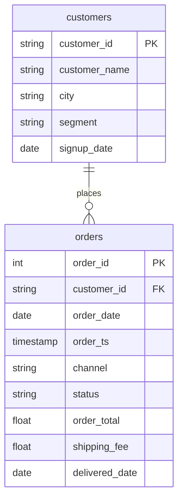

# One row per customer

In this activity, you will build a customer summary in two named steps: completed orders, revenue, and the dates of the first and last completed order for every customer, including those with no completed order, and then audit it.

**Time:** 18 minutes · **Data:** `nakheel.orders`, `nakheel.customers` · **Starter:** `Unsolved/customer_summary.sql`

Before you start, answer two questions in a comment: what is one row of the final answer, and which table has every customer?

## How the tables connect

Join key: `orders.customer_id = customers.customer_id`.

PK is the primary key: it names one row. FK is a foreign key: it points to a row in another table. The line between two tables shows the join: the end with two short bars is the "one" side, and the end that splits into a fork is the "many" side.

## Instructions

1. "For each customer who has bought from us: how many completed orders, how much revenue, and the dates of their first and last completed order." Write it as a CTE named `completed`, then read it with `SELECT * FROM completed`. Predict the row count first; you saw it in [From nested to named](../04-Ins-Nested-To-Named/README.md).

    Translate: completed orders only, `GROUP BY customer_id`; `COUNT(*)`, `SUM(order_total)`, `MIN(order_date)` and `MAX(order_date)`, each with a name. Name the dates `first_order` and `last_order`. They count completed orders only, because the `WHERE` keeps only those: a cancelled order does not move them.

2. "Now every customer, including those who have never completed an order. Show 0 for them, not a blank."

    Translate: start `FROM nakheel.customers` and `LEFT JOIN completed` on `customer_id`. Show the ID, the name, the cleaned segment as `segment_clean`, `COALESCE(x.completed_orders, 0)`, the revenue rounded and with `COALESCE`, and the two dates. Largest revenue first.

3. "Check it: how many customers, completed orders and revenue does the summary hold, and how many customers have none?"

    Translate: turn step 2 into a second CTE named `summary` (the columns you need to count and add), then one `SELECT` over it: `COUNT(*)`, `SUM(completed_orders)`, `ROUND(SUM(revenue), 2)` and `COUNTIF(completed_orders = 0)`. `COUNTIF` counts the rows where the test is true; it is a BigQuery function.

    Then compare the revenue with completed revenue on `orders` alone, 316,023.50. Explain the difference in a comment.

Keep this query. You save it as a view in the lab, [Reporting views for Power BI and for D10](../10-Lab-Reporting-Views/README.md), and D10's first machine-learning model starts from it.

## Check yourself

| Step | Rows returned | One value to check |
|---|---:|---|
| 1 | 452 | 451 customers plus C-0999 |
| 2 | 500 | C-1380 Leen Najjar first: 82 orders, 35,338.50 |
| 3 | 1 | 500 customers; 2,770 orders; 315,085.50; 49 with none |

If step 2 has 452 rows, you started from the CTE; if it has 451, you used an `INNER JOIN`. Which table has every customer, and which join keeps them all? The 938.00 difference in step 3 is one order you have met before.

## Hint

`COALESCE(x.completed_orders, 0)` returns 0 when the value is `NULL`. A customer with no completed orders spent 0, not an unknown amount. The dates stay `NULL`: there is no completed order to show.

## Bonus

Not required, not checked. "Which customers have placed orders, but none of them completed?" Start from your `completed` CTE and `customers`, keep the customers with no completed order, and use a subquery with `IN` to keep only those whose ID appears in `orders`. Expect 10 rows. With the 39 who never ordered, they make the 49 in step 3.

## Check yourself: bonus

| Question | Rows returned | One value to check |
|---|---:|---|
| Bonus | 10 | C-1006 Jana Saleh first by ID |

## References

Nakheel Retail, course-owned synthetic data generated 24 September 2026. See [the dataset README](../../D04/03-Evr-Upload-Nakheel/Resources/README.md).
