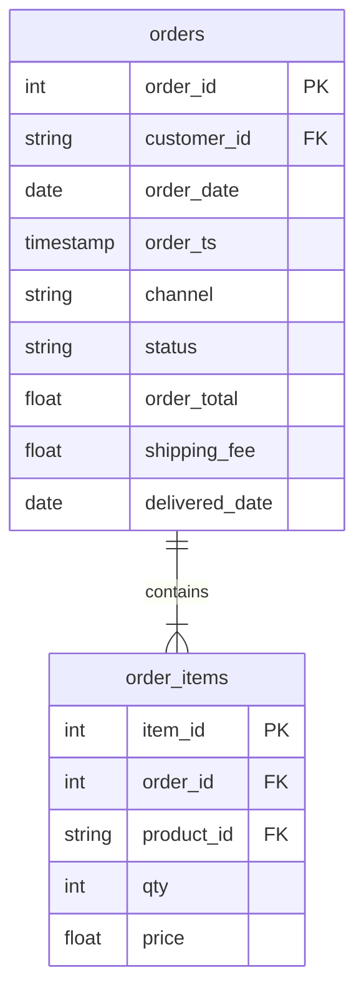

# Save a query as a view

In this activity, you will create a dataset called `bi`, save the order-line join as a view named `bi.fact_sales`, look at what BigQuery stores for it, and read it like a table.

**Time:** 15 minutes · **Data:** `nakheel.order_items`, `nakheel.orders` · **File:** `Solved/first_view.sql`

A CTE lasts only while its query runs. A **view** is a query saved in a dataset under a name, so you, a colleague or Power BI (from D17) can read the result by name without copying the SQL. A view stores no rows. Every time you read it, BigQuery runs its query again on the tables underneath, so it is always up to date.

## How the tables connect



Join key: `order_items.order_id = orders.order_id`.

PK is the primary key: it names one row. FK is a foreign key: it points to a row in another table. The line between two tables shows the join: the end with two short bars is the "one" side, and the end that splits into a fork is the "many" side.

## Instructions

1. Create the dataset `bi` in the BigQuery console:

    - In the **Explorer**, click **⋮** next to your project, then **Create dataset**.
    - **Dataset ID:** `bi` (short for business intelligence: the tables reports read).
    - **Location type:** the same as `nakheel`. The [D04 upload guide](../../D04/03-Evr-Upload-Nakheel/README.md) used **Multi-region**, **US**. If you are not sure, click `nakheel` and look at **Data location** on its **Details** tab.
    - Click **Create dataset**.

    You should see `bi` under your project, next to `nakheel`. It must be in the same location as `nakheel`, because a view can only read tables in its own location.

2. Create the first view: one row per order line, with what a report needs from the order. Type and run:

    ```sql
    CREATE OR REPLACE VIEW bi.fact_sales AS
    SELECT i.item_id,
           i.order_id,
           o.order_date,
           o.channel,
           o.status,
           o.customer_id,
           i.product_id,
           i.qty,
           i.price,
           i.qty * i.price AS revenue
    FROM nakheel.order_items AS i
    INNER JOIN nakheel.orders AS o
      ON i.order_id = o.order_id;
    ```

    - `CREATE OR REPLACE VIEW bi.fact_sales AS` saves the `SELECT` under that name. `OR REPLACE` lets you run it again after a fix.
    - Everything after `AS` is an ordinary query: the D06 join.
    - There is no `WHERE status = 'completed'`. The view keeps every status, so each report can filter as it needs.
    - There is no `ORDER BY`. A view does not need one; sort when you read it.

    You should see "This statement created a new view named …fact_sales" ("replaced" if you run it a second time).

3. Look at the view. Refresh the **Explorer** and expand `bi`. You should see `fact_sales` with a view icon, different from the table icon next to `nakheel`'s tables. Click it:

    - **Schema** lists its 10 columns.
    - **Details** shows the SQL you saved.
    - There is no **Preview** tab with rows and no storage size, because the view holds no rows.

4. Read the view like a table: the audit. Type the query below, and before you run it, read the bytes estimate at the top right of the editor.

    ```sql
    SELECT COUNT(*) AS line_rows,
           COUNT(DISTINCT order_id) AS different_orders,
           ROUND(SUM(revenue), 2) AS all_revenue,
           ROUND(SUM(CASE WHEN status = 'completed' THEN revenue END), 2) AS completed_revenue
    FROM bi.fact_sales;
    ```

    You should see 7,516 lines; 3,000 orders; 340,370.00; completed 316,023.50. The lines and both revenues are the numbers from the D06 lab, [Revenue by category, with a join audit](../../D06/09-Lab-Category-Revenue/README.md). 3,000 is the number of orders you uploaded on D04.

5. What a view costs. The bytes estimate in step 4 is the size of the columns read from `order_items` and `orders`, because every read of the view runs the join again. A view costs nothing to store and costs a query every time it is read. On Nakheel that is tiny. On a table of billions of rows, a view that many people read is a query that many people pay for. In the BigQuery sandbox, those reads count against the free monthly query allowance.

If you need the result stored instead, save it as a table with `CREATE TABLE … AS SELECT`. A table is fast to read but goes out of date when the source tables change. D14 stores model predictions in a table for that reason.

## Check yourself

| Step | Rows returned | One value to check |
|---|---:|---|
| 4 | 1 | 7,516 lines; 3,000 orders; 340,370.00; completed 316,023.50 |

BigQuery shows money such as `340370.0` without separators. The number is the same.

## If something goes wrong

| Problem | Fix |
|---|---|
| `Not found: Dataset <project>:bi` | `bi` was not created, or was created under a different name. Create it (step 1) |
| An error that a table was "not found in location" | `bi` is in a different location from `nakheel`. Delete `bi` (**⋮** next to it → **Delete**) and create it again in the same location as `nakheel` |
| `fact_sales` does not appear under `bi` | Refresh the Explorer |

## References

Nakheel Retail, course-owned synthetic data generated 24 September 2026. See [the dataset README](../../D04/03-Evr-Upload-Nakheel/Resources/README.md).
