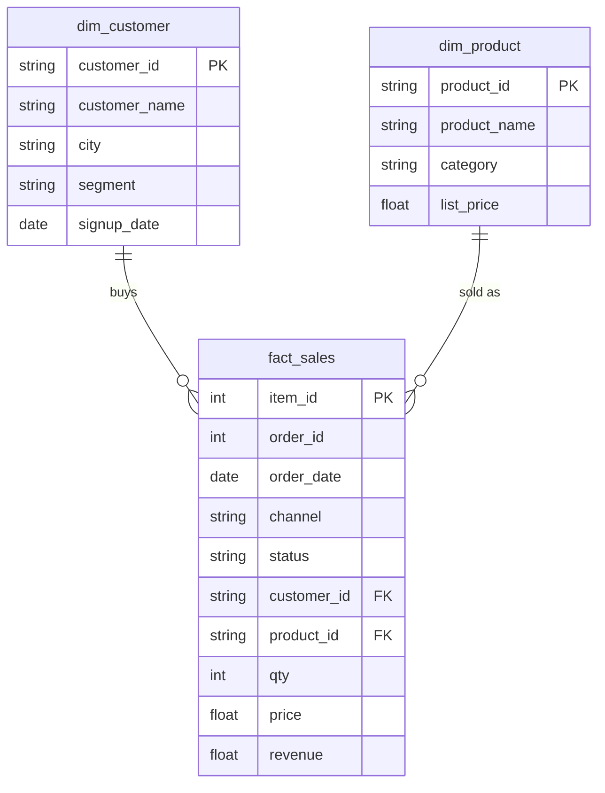

# Lab: Reporting views for Power BI and for D10

In this lab, you will save three more views in `bi`, each with an audit: a one-row-per-customer summary, completed revenue by category and month, and a customer list that also covers the customer ID that has orders but no record.

**Time:** about 25 minutes in class, then finish after class · **Data:** `nakheel.orders`, `nakheel.customers`, `bi.fact_sales`, `bi.dim_customer`, `bi.dim_product` · **Starter:** `Unsolved/reporting_views.sql`

**Before you start:** the `bi` dataset holds `fact_sales`, `dim_customer` and `dim_product`. If any is missing, create it with [Save a query as a view](../07-Ins-First-View/README.md) and [The customer and product views](../08-Evr-Dimension-Views/README.md).

**When:** you start the lab in class and finish it after class. The Solved folder is released afterwards.

**What you hand in:** nothing. Save your `.sql` file with the audit table filled in. It is the fifth of the files you choose from for Assignment 1, which is issued on D09 (Sunday 11 October).

**Keep the `bi` views.** D09 and D10 read them, and Power BI reads them from D17. Do not delete the `bi` dataset. In the BigQuery sandbox a view expires 60 days after it is created, which is after the course ends.

## How the tables connect

Join keys: `fact_sales.customer_id = dim_customer.customer_id` and `fact_sales.product_id = dim_product.product_id`. `fact_sales` is the fact table, one row per order line. The two `dim_` views describe its customers and products. For how `nakheel.orders` and `nakheel.customers` connect, see the [Nakheel dataset diagram](../../../../../shared/datasets/nakheel/README.md#how-the-tables-connect).

PK is the primary key: it names one row. FK is a foreign key: it points to a row in another table. The line between two tables shows the join: the end with two short bars is the "one" side, and the end that splits into a fork is the "many" side.

## The audit table

Record these numbers as you go and compare each with what you already know:

| Audit | Rows | Completed orders or lines | Revenue |
|---|---:|---:|---:|
| `orders`, completed only (known since D06) | | | |
| `bi.customer_summary` | | | |
| `bi.category_month` | | – | |
| `fact_sales INNER JOIN dim_customer_complete`, completed | | | |

If a number differs from the one above it and you cannot say why, stop and find out before you go on.

## C1 · bi.customer_summary

1. Save your query from [One row per customer](../06-Stu-Customer-Summary/README.md) as a view named `bi.customer_summary`. Build it on `bi.dim_customer` instead of `nakheel.customers`, so the city and segment arrive already cleaned. Columns: `customer_id`, `customer_name`, `segment`, `city`, `completed_orders`, `revenue`, `first_order`, `last_order`. No `ORDER BY`.

    Translate: `CREATE OR REPLACE VIEW bi.customer_summary AS`, then your `WITH completed AS (...)` and a `SELECT` from `bi.dim_customer LEFT JOIN completed`. A view can start with `WITH`.

2. Audit the view: the number of customers, `SUM(completed_orders)`, the revenue and `COUNTIF(completed_orders = 0)`, reading from `bi.customer_summary`.

**Checkpoint C1:** 500 customers; 2,770 completed orders; 315,085.50; 49 customers with none. The 938.00 gap to 316,023.50 is order 101664, as in One row per customer. D10's first machine-learning model starts from this view.

## C2 · bi.category_month

3. "Completed units and revenue by product category and month, for a Power BI line chart." Save it as `bi.category_month`.

    Translate: `bi.fact_sales INNER JOIN bi.dim_product`; completed lines only; `p.category`, `DATE_TRUNC(f.order_date, MONTH) AS month`, `SUM(f.qty) AS units`, `SUM(f.revenue) AS revenue`; `GROUP BY` category and month. Leave the revenue unrounded in the view and round it when you read it.

4. Audit: the number of rows and `ROUND(SUM(revenue), 2)`. Predict the rows first: how many categories, and how many months?

**Checkpoint C2:** 144 rows (6 categories × 24 months) and 316,023.50.

## C3 · bi.dim_customer_complete

5. "Every customer, plus one row for each customer ID that has orders but no customer record, so no order line loses its customer." Save it as `bi.dim_customer_complete`, in two named steps:

    - a CTE named `missing`: the different `customer_id` values in `orders` that have no match in `customers`. This is the D07 anti-join from [Never ordered, never sold](../../D07/02-Stu-Never-Ordered/README.md), turned the other way round.
    - then `bi.dim_customer` stacked with `UNION ALL` on one row per missing ID: the ID, `'Unknown customer'`, `'unknown'` for the city, `'unknown'` for the segment, and an empty `signup_date`.

    Both halves return the same five columns in the same order as `dim_customer`: `customer_id`, `customer_name`, `city`, `segment`, `signup_date`.

6. Audit: join `bi.fact_sales INNER JOIN bi.dim_customer_complete` on `customer_id`, completed lines only, and record the lines and the revenue. Compare them with step 3 of [Prove the views give the numbers you know](../09-Evr-Check-The-Views/README.md): 6,946 lines and 315,085.50. Then read the whole view with `SELECT *` and look at its rows (6b in Check yourself).

**Checkpoint C3:** the view has 501 rows, and the audit shows 6,951 lines and 316,023.50. The `INNER JOIN` no longer loses anything.

## Check yourself

| Step | Rows returned | One value to check |
|---|---:|---|
| 2 | 1 | 500; 2,770; 315,085.50; 49 |
| 4 | 1 | 144 rows; 316,023.50 |
| 6 | 1 | 6,951 lines; 316,023.50 |
| 6b | 501 | the view itself: 500 customers and C-0999 |

Steps 1, 3 and 5 create views, so they return no rows. You should see "This statement created a new view" (or "replaced").

## Hint

For C1, start from the table that has every customer, and `LEFT JOIN` the CTE to it. For C3, write the empty date as `CAST(NULL AS DATE)`, so both halves of the `UNION ALL` have a date in that column. The column names come from the first half.

## Stretch card

Not required, not checked. "Completed units and revenue by customer segment and month." Save it as `bi.segment_month`, on the pattern of `bi.category_month`, but joined to `bi.dim_customer_complete` so order 101664 gets the segment `unknown`. Predict the rows before you audit: 2 segments × 24 months, plus the months in which the unknown customer ordered. Audit with the number of rows and the rounded total.

## More practice

**Not checked and not submitted.** Solutions are in the Solved file. Each uses a view you made today.

- X1 "Which customers spent more than the average customer?" Use `bi.customer_summary` and a subquery. The average includes the customers who spent 0.
- X2 "Completed revenue by city, now that every order line has a customer." Use `bi.fact_sales` and `bi.dim_customer_complete`, and count the different orders as well as the revenue. Compare with [A cleaning rule of your own](../../D07/05-Evr-City-Rule/README.md).
- X3 "In which months did Outerwear do better than its own average month?" Use `bi.category_month`. The category filter goes inside the brackets as well as outside.

## Check yourself: stretch card and more practice

| Question | Rows returned | One value to check |
|---|---:|---|
| S1 | 1 | 49 rows; 316,023.50 |
| X1 | 94 | the average is 630.17; C-1380 Leen Najjar first, 35,338.50 |
| X2 | 9 | amman first: 1,064 orders, 130,848.00; unknown 37 orders, 3,197.00 |
| X3 | 10 | Outerwear's average month is 3,193.21; April 2026 the best, 5,068.50 |

## If something goes wrong

| Problem | Fix |
|---|---|
| C1 has 452 rows | The view starts from the CTE, not from `bi.dim_customer`. Start from the customers and `LEFT JOIN` the CTE |
| C2 has 24 rows | You grouped by month only. Add `p.category` to the `SELECT` and the `GROUP BY` |
| C3 stops with `Queries in UNION ALL have mismatched column count` | Both halves need the same five columns in the same order |
| C3 stops with an error about the type of `signup_date` | Write the empty date as `CAST(NULL AS DATE)` |
| `Not found: Dataset <project>:bi` | The `bi` dataset is missing or spelled differently. See [Save a query as a view](../07-Ins-First-View/README.md), step 1 |

## References

Nakheel Retail, course-owned synthetic data generated 24 September 2026. See [the dataset README](../../D04/03-Evr-Upload-Nakheel/Resources/README.md).
