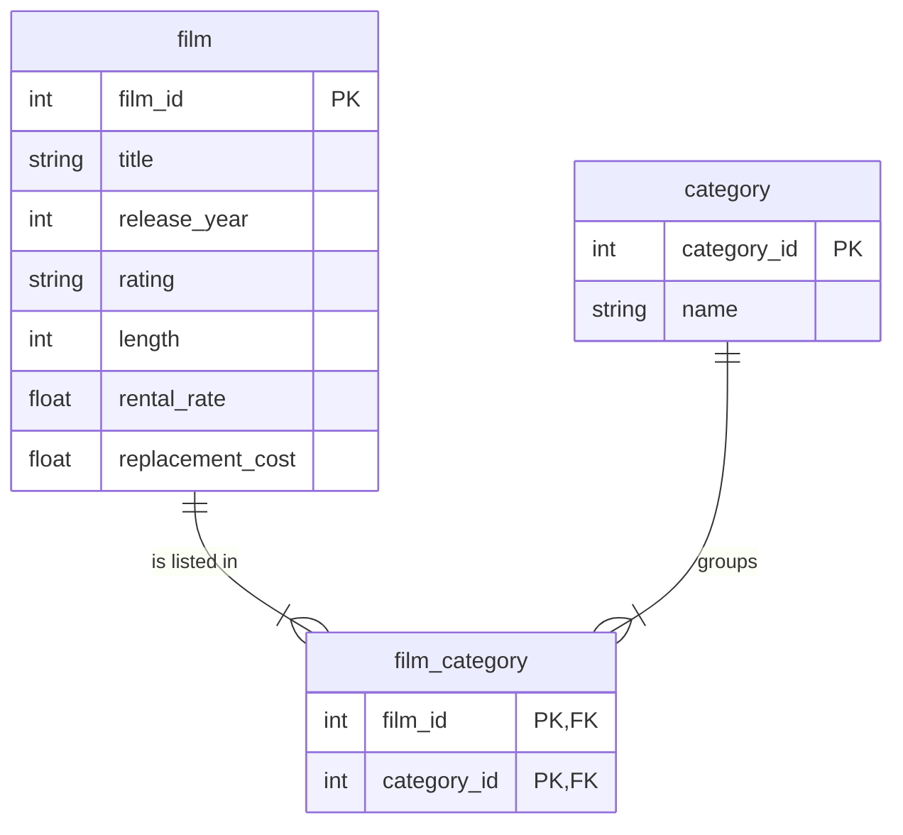

# Pagila films

Three tables from Pagila, a sample database for a DVD rental shop: 1,000 films, 16 categories, and the table that links them. You use them on D07, in activity 08 (A bridge table: films per category, [`labs/D07/08-Evr-Films-Per-Category`](../../../modules/02-sql/labs/D07/08-Evr-Films-Per-Category/README.md)), to practise a join through a table that sits between two others. The D07 lab's more practice uses `film` too.

| Fact | Value |
|---|---|
| Source | [Pagila](https://github.com/devrimgunduz/pagila) by Devrim Gündüz, a PostgreSQL port of MySQL's Sakila sample database |
| Version | `master` branch, commit `9baf49c` of 20 September 2026, file `pagila-data.sql` |
| Downloaded | 24 September 2026 |
| Course copy | Three of Pagila's tables, exported to CSV. Columns not needed for the course were left out (`description`, `language_id`, `original_language_id`, `rental_duration`, `last_update`, `special_features`, `fulltext`). No values changed |
| Licence | The included [LICENSE.txt](LICENSE.txt) is an MIT-style permission notice (copyright Devrim Gündüz); its README describes the database as available under the PostgreSQL licence. Both allow copying and redistribution with the notice kept |
| Content | The film titles and descriptions are invented; they are not real films |

## Files

| File | Rows | Columns |
|---|---:|---|
| `film.csv` | 1,000 | `film_id`, `title`, `release_year`, `rating`, `length`, `rental_rate`, `replacement_cost` |
| `category.csv` | 16 | `category_id`, `name` |
| `film_category.csv` | 2,367 | `film_id`, `category_id` |

`length` is the running time in minutes. `rental_rate` and `replacement_cost` are in US dollars. `rating` is the US film rating (G, PG, PG-13, R, NC-17).

Upload them into a BigQuery dataset named `pagila`, table names as the file names without `.csv`.

## How the tables connect

PK is the primary key, FK a foreign key. `film` and `category` never point at each other directly. A film can belong to more than one category (up to three in this copy), so each link is a row of its own in `film_category`: one row per film per category. Its key is the pair of columns, `film_id` and `category_id` together. To go from a film to its category names, join through `film_category`.

Every film has at least one category, and every category has at least one film.

## Attribution

Please keep this with any copy of the files:

> Pagila sample database, copyright Devrim Gündüz, https://github.com/devrimgunduz/pagila. Derived from the Sakila sample database by Mike Hillyer, MySQL AB. Used under the permission notice in the repository's LICENSE.txt.
